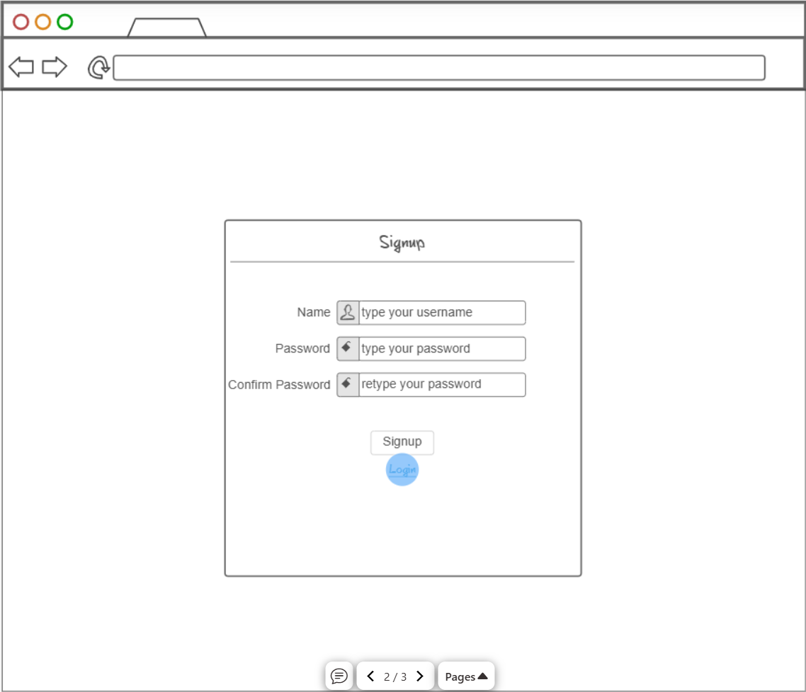
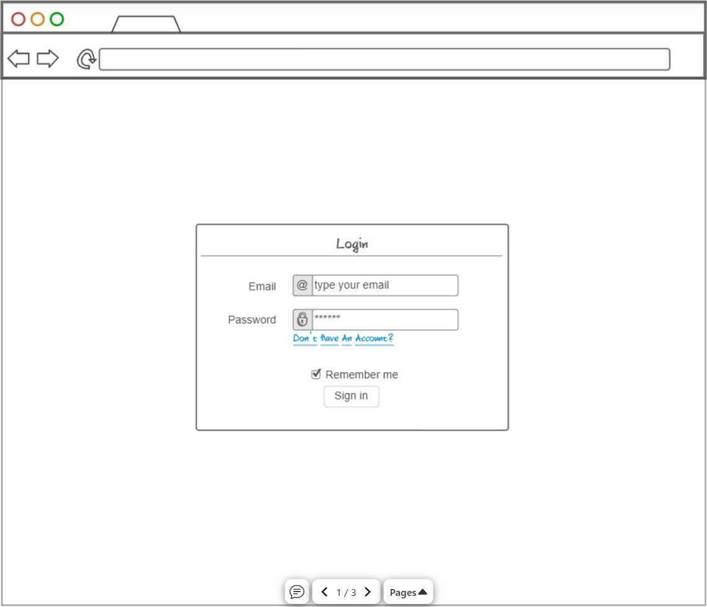
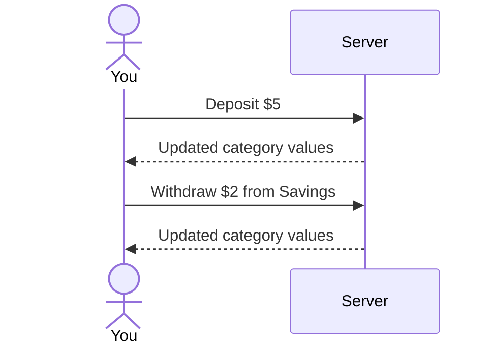

# Budget Center

[My Notes](notes.md)

A website to help you keep track of your money. By creating budget categories, you can more easily build your savings, set aside your tithing, and stick with your budgeting plans. It allows you to deposit money between these budget categories according to customizable ratios. Every action is logged, giving you an in depth history of what you have done with your money.

## 🚀 Specification Deliverable

> [!NOTE]
>  Fill in this sections as the submission artifact for this deliverable. You can refer to this [example](https://github.com/webprogramming260/startup-example/blob/main/README.md) for inspiration.

For this deliverable I did the following. I checked the box `[x]` and added a description for things I completed.

- [x] Proper use of Markdown
- [x] A concise and compelling elevator pitch
- [x] Description of key features
- [x] Description of how you will use each technology
- [x] One or more rough sketches of your application. Images must be embedded in this file using Markdown image references.

### Elevator pitch

Have you ever struggled to stick to a budget? Have you ever wanted to cut down on wasteful spending? Then Budget Center is the solution for you! With it, you can create categories to take control of your money. By making and saving different ratios, you can fine tune where your money goes. And when you have control over where your money goes, you control where you go.

### Design

Here is a sequence diagram that shows how you would interact with the server to make a deposit and a withdrawl:

### Key features

- Secure login and account management
- Deposit money to multiple categories through customizable ratio profiles
- Withdraw money from categories
- Transfer money between categories
- Ability to create, rename, and merge categories
- Log all movement of money in each category
- Displays total of all accounts with a central pie chart
- Account data is persistently stored and can be accessed from any device

### Technologies

I am going to use the required technologies in the following ways.

- **HTML** - Uses the correct HTML structure. There will be three HTML pages. One for signing up, one for logging in, and one for the budget application.
- **CSS** - CSS that allows for adjustable screen sizes, makes good use of space, and makes good use of color, leading to an aesthetically pleasing experience.
- **React** - Makes up the login/signup, updates totals/logs after useer input, and allows for the user to switch between interfaces in the budget page.
- **Service** - Backend server functionality for the following:
  - Saving and retrieving user budget data
  - Sign up, login, and log out for each user
  - Calculation of values for deposits, withdrawls, and log modifications
  - Calls to https://www.purgomalum.com to check for inappropriate usernames/category names
- **DB/Login** - Store users, total values, saved ratio profiles, and logs. Register and log in users, securely storing user credentials. Unable to access budget page without account.
- **WebSocket** - Display number of total and concurrent users that have accounts.

## 🚀 AWS deliverable

For this deliverable I did the following. I checked the box `[x]` and added a description for things I completed.

- [ ] **Server deployed and accessible with custom domain name** - [My server link](https://yourdomainnamehere.click).

## 🚀 HTML deliverable

For this deliverable I did the following. I checked the box `[x]` and added a description for things I completed.

- [ ] **HTML pages** - I did not complete this part of the deliverable.
- [ ] **Proper HTML element usage** - I did not complete this part of the deliverable.
- [ ] **Links** - I did not complete this part of the deliverable.
- [ ] **Text** - I did not complete this part of the deliverable.
- [ ] **3rd party API placeholder** - I did not complete this part of the deliverable.
- [ ] **Images** - I did not complete this part of the deliverable.
- [ ] **Login placeholder** - I did not complete this part of the deliverable.
- [ ] **DB data placeholder** - I did not complete this part of the deliverable.
- [ ] **WebSocket placeholder** - I did not complete this part of the deliverable.

## 🚀 CSS deliverable

For this deliverable I did the following. I checked the box `[x]` and added a description for things I completed.

- [ ] **Header, footer, and main content body** - I did not complete this part of the deliverable.
- [ ] **Navigation elements** - I did not complete this part of the deliverable.
- [ ] **Responsive to window resizing** - I did not complete this part of the deliverable.
- [ ] **Application elements** - I did not complete this part of the deliverable.
- [ ] **Application text content** - I did not complete this part of the deliverable.
- [ ] **Application images** - I did not complete this part of the deliverable.

## 🚀 React part 1: Routing deliverable

For this deliverable I did the following. I checked the box `[x]` and added a description for things I completed.

- [ ] **Bundled using Vite** - I did not complete this part of the deliverable.
- [ ] **Components** - I did not complete this part of the deliverable.
- [ ] **Router** - I did not complete this part of the deliverable.

## 🚀 React part 2: Reactivity deliverable

For this deliverable I did the following. I checked the box `[x]` and added a description for things I completed.

- [ ] **All functionality implemented or mocked out** - I did not complete this part of the deliverable.
- [ ] **Hooks** - I did not complete this part of the deliverable.

## 🚀 Service deliverable

For this deliverable I did the following. I checked the box `[x]` and added a description for things I completed.

- [ ] **Node.js/Express HTTP service** - I did not complete this part of the deliverable.
- [ ] **Static middleware for frontend** - I did not complete this part of the deliverable.
- [ ] **Calls to third party endpoints** - I did not complete this part of the deliverable.
- [ ] **Backend service endpoints** - I did not complete this part of the deliverable.
- [ ] **Frontend calls service endpoints** - I did not complete this part of the deliverable.
- [ ] **Supports registration, login, logout, and restricted endpoint** - I did not complete this part of the deliverable.

## 🚀 DB deliverable

For this deliverable I did the following. I checked the box `[x]` and added a description for things I completed.

- [ ] **Stores data in MongoDB** - I did not complete this part of the deliverable.
- [ ] **Stores credentials in MongoDB** - I did not complete this part of the deliverable.

## 🚀 WebSocket deliverable

For this deliverable I did the following. I checked the box `[x]` and added a description for things I completed.

- [ ] **Backend listens for WebSocket connection** - I did not complete this part of the deliverable.
- [ ] **Frontend makes WebSocket connection** - I did not complete this part of the deliverable.
- [ ] **Data sent over WebSocket connection** - I did not complete this part of the deliverable.
- [ ] **WebSocket data displayed** - I did not complete this part of the deliverable.
- [ ] **Application is fully functional** - I did not complete this part of the deliverable.
